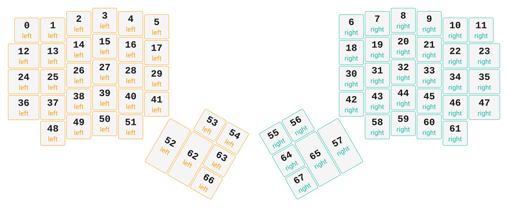

# ZMK Configuration for ERGO S-1

*Generated by Shield Wizard for ZMK*



Download compiled firmware from the Actions tab. <https://zmk.dev/docs/user-setup#installing-the-firmware>

Edit your keymap <https://zmk.dev/docs/keymaps>.
User keymap is located at [`config/ergo_s_1.keymap`](config/ergo_s_1.keymap).

-----

<details>
<summary>
Shield Wizard Debug Information
</summary>

In case of broken configuration, here is the Shield Wizard internal data used to generate this configuration:

Commit: 5840d41ac0915092c8fe45da617ffb4bb91e1b97

```json
{"name":"ERGO S-1","shield":"ergo_s_1","dongle":true,"modules":["badjeff/pmw3610"],"layout":[{"id":"01KKY10BX9SZFRP4HZGBSPQ6EZ","part":0,"row":0,"col":0,"w":1,"h":1,"x":0.5,"y":0.38,"r":0,"rx":0,"ry":0},{"id":"01KKY10BX9MRYEH4RHY15YQSZ4","part":0,"row":0,"col":1,"w":1,"h":1,"x":1.5,"y":0.375,"r":0,"rx":0,"ry":0},{"id":"01KKY10BX9SC5BEK1BS8YPGDTT","part":0,"row":0,"col":2,"w":1,"h":1,"x":2.5,"y":0.125,"r":0,"rx":0,"ry":0},{"id":"01KKY10BX9F8QYYXPK6MJ29R6D","part":0,"row":0,"col":3,"w":1,"h":1,"x":3.5,"y":0,"r":0,"rx":0,"ry":0},{"id":"01KKY10BX9YT2N8R5B6ZYENAPK","part":0,"row":0,"col":4,"w":1,"h":1,"x":4.5,"y":0.125,"r":0,"rx":0,"ry":0},{"id":"01KKY10BX9WD0R7PX9NZXWA4E2","part":0,"row":0,"col":5,"w":1,"h":1,"x":5.5,"y":0.25,"r":0,"rx":0,"ry":0},{"id":"01KKY10BX9M3W7KPRXPVK4QB6V","part":1,"row":0,"col":10,"w":1,"h":1,"x":13,"y":0.25,"r":0,"rx":0,"ry":0},{"id":"01KKY10BX9V5M3A3XQAF3VKB06","part":1,"row":0,"col":11,"w":1,"h":1,"x":14,"y":0.125,"r":0,"rx":0,"ry":0},{"id":"01KKY10BX95G8TNTFHPNBYCFCR","part":1,"row":0,"col":12,"w":1,"h":1,"x":15,"y":0,"r":0,"rx":0,"ry":0},{"id":"01KKY10BX9W8K0K0K8KE9WF1JW","part":1,"row":0,"col":13,"w":1,"h":1,"x":16,"y":0.125,"r":0,"rx":0,"ry":0},{"id":"01KKY10BX9D5WTJRM4WCBB1GQV","part":1,"row":0,"col":14,"w":1,"h":1,"x":17,"y":0.375,"r":0,"rx":0,"ry":0},{"id":"01KKY10BX9DRZXBJD1RW164ZBS","part":1,"row":0,"col":15,"w":1,"h":1,"x":18,"y":0.375,"r":0,"rx":0,"ry":0},{"id":"01KKY10BX95AHFE3F914FWYRKQ","part":0,"row":1,"col":0,"w":1.25,"h":1,"x":0.25,"y":1.38,"r":0,"rx":0,"ry":0},{"id":"01KKY10BX9A49147CARP80ZS0K","part":0,"row":1,"col":1,"w":1,"h":1,"x":1.5,"y":1.375,"r":0,"rx":0,"ry":0},{"id":"01KKY10BX9TW1045FHRF7CQ7BD","part":0,"row":1,"col":2,"w":1,"h":1,"x":2.5,"y":1.125,"r":0,"rx":0,"ry":0},{"id":"01KKY10BX9HF1K5KM0BCCQHS1H","part":0,"row":1,"col":3,"w":1,"h":1,"x":3.5,"y":1,"r":0,"rx":0,"ry":0},{"id":"01KKY10BX9HEHSZ228YJMN5KHA","part":0,"row":1,"col":4,"w":1,"h":1,"x":4.5,"y":1.125,"r":0,"rx":0,"ry":0},{"id":"01KKY10BX9FZMNDCBBTF3XC9JN","part":0,"row":1,"col":5,"w":1,"h":1,"x":5.5,"y":1.25,"r":0,"rx":0,"ry":0},{"id":"01KKY10BX9MNSKBG4JG097PKN0","part":1,"row":1,"col":10,"w":1,"h":1,"x":13,"y":1.25,"r":0,"rx":0,"ry":0},{"id":"01KKY10BX94NQ9HB6F1BMMMFN6","part":1,"row":1,"col":11,"w":1,"h":1,"x":14,"y":1.125,"r":0,"rx":0,"ry":0},{"id":"01KKY10BX9DC89V9FJMSC4V2S3","part":1,"row":1,"col":12,"w":1,"h":1,"x":15,"y":1,"r":0,"rx":0,"ry":0},{"id":"01KKY10BX91V62ZMVHZGM4Q1ET","part":1,"row":1,"col":13,"w":1,"h":1,"x":16,"y":1.125,"r":0,"rx":0,"ry":0},{"id":"01KKY10BX9G6K2YZABGACRFSTC","part":1,"row":1,"col":14,"w":1,"h":1,"x":17,"y":1.375,"r":0,"rx":0,"ry":0},{"id":"01KKY10BX9HZVRGG31PB056MMK","part":1,"row":1,"col":15,"w":1.25,"h":1,"x":18,"y":1.375,"r":0,"rx":0,"ry":0},{"id":"01KKY10BXADMWEX2M6EY3HPSZY","part":0,"row":2,"col":0,"w":1.25,"h":1,"x":0.25,"y":2.38,"r":0,"rx":0,"ry":0},{"id":"01KKY10BXA93AXC761A6RF5ERR","part":0,"row":2,"col":1,"w":1,"h":1,"x":1.5,"y":2.375,"r":0,"rx":0,"ry":0},{"id":"01KKY10BX98GYR5HPHV9AQEAKM","part":0,"row":2,"col":2,"w":1,"h":1,"x":2.5,"y":2.125,"r":0,"rx":0,"ry":0},{"id":"01KKY10BX9MGVKW59XPKA6ATBW","part":0,"row":2,"col":3,"w":1,"h":1,"x":3.5,"y":2,"r":0,"rx":0,"ry":0},{"id":"01KKY10BX9JQB8YCBQX05X2Z4B","part":0,"row":2,"col":4,"w":1,"h":1,"x":4.5,"y":2.125,"r":0,"rx":0,"ry":0},{"id":"01KKY10BX93VBE9GD4AXQ8F5KD","part":0,"row":2,"col":5,"w":1,"h":1,"x":5.5,"y":2.25,"r":0,"rx":0,"ry":0},{"id":"01KKY10BXAZ788TJDQ2BRVE03R","part":1,"row":2,"col":10,"w":1,"h":1,"x":13,"y":2.25,"r":0,"rx":0,"ry":0},{"id":"01KKY10BX9FQZ2H8Y737A66CYJ","part":1,"row":2,"col":11,"w":1,"h":1,"x":14,"y":2.125,"r":0,"rx":0,"ry":0},{"id":"01KKY10BX9WYCVT00MMCYN8MB5","part":1,"row":2,"col":12,"w":1,"h":1,"x":15,"y":2,"r":0,"rx":0,"ry":0},{"id":"01KKY10BX9V9X43WKW6AS57RA2","part":1,"row":2,"col":13,"w":1,"h":1,"x":16,"y":2.125,"r":0,"rx":0,"ry":0},{"id":"01KKY10BXA8C3MXBBTDHC8Y2TE","part":1,"row":2,"col":14,"w":1,"h":1,"x":17,"y":2.375,"r":0,"rx":0,"ry":0},{"id":"01KKY10BXAWDRAHE12XS83V78E","part":1,"row":2,"col":15,"w":1.25,"h":1,"x":18,"y":2.375,"r":0,"rx":0,"ry":0},{"id":"01KKY10BXAHMMEG9ESXXQX6SFQ","part":0,"row":3,"col":0,"w":1.25,"h":1,"x":0.25,"y":3.38,"r":0,"rx":0,"ry":0},{"id":"01KKY10BXAC63TJX26PK3K64J7","part":0,"row":3,"col":1,"w":1,"h":1,"x":1.5,"y":3.375,"r":0,"rx":0,"ry":0},{"id":"01KKY10BXAM3D3V4KSN8EAYR4F","part":0,"row":3,"col":2,"w":1,"h":1,"x":2.5,"y":3.125,"r":0,"rx":0,"ry":0},{"id":"01KKY10BXAF4XWZMYXPP8J2G6W","part":0,"row":3,"col":3,"w":1,"h":1,"x":3.5,"y":3,"r":0,"rx":0,"ry":0},{"id":"01KKY10BXA8E75A93B5238F2T3","part":0,"row":3,"col":4,"w":1,"h":1,"x":4.5,"y":3.125,"r":0,"rx":0,"ry":0},{"id":"01KKY10BXA0M4S19ACVD5MX4CS","part":0,"row":3,"col":5,"w":1,"h":1,"x":5.5,"y":3.25,"r":0,"rx":0,"ry":0},{"id":"01KKY10BXA5EKW0T76BZAMXDZH","part":1,"row":3,"col":10,"w":1,"h":1,"x":13,"y":3.25,"r":0,"rx":0,"ry":0},{"id":"01KKY10BXAPK84B2019S15W7RF","part":1,"row":3,"col":11,"w":1,"h":1,"x":14,"y":3.125,"r":0,"rx":0,"ry":0},{"id":"01KKY10BXA7DXE1ZBAE8V8NYM6","part":1,"row":3,"col":12,"w":1,"h":1,"x":15,"y":3,"r":0,"rx":0,"ry":0},{"id":"01KKY10BXAJWT0Y7R9H5BFQ7W7","part":1,"row":3,"col":13,"w":1,"h":1,"x":16,"y":3.125,"r":0,"rx":0,"ry":0},{"id":"01KKY10BXA037E7H31GQYC59DH","part":1,"row":3,"col":14,"w":1,"h":1,"x":17,"y":3.375,"r":0,"rx":0,"ry":0},{"id":"01KKY10BXAY214M1J66Q43WRWX","part":1,"row":3,"col":15,"w":1.25,"h":1,"x":18,"y":3.375,"r":0,"rx":0,"ry":0},{"id":"01KKY10BXAB2ZBBE7JWZGZMKST","part":0,"row":4,"col":1,"w":1,"h":1,"x":1.5,"y":4.375,"r":0,"rx":0,"ry":0},{"id":"01KKY10BXAWG8TV4N97DZ6BY81","part":0,"row":4,"col":2,"w":1,"h":1,"x":2.5,"y":4.125,"r":0,"rx":0,"ry":0},{"id":"01KKY10BXATW6XKXF9CQ0ZECJN","part":0,"row":4,"col":3,"w":1,"h":1,"x":3.5,"y":4,"r":0,"rx":0,"ry":0},{"id":"01KKY10BXACQ4GQSE8AF7GCQ0C","part":0,"row":4,"col":4,"w":1,"h":1,"x":4.5,"y":4.125,"r":0,"rx":0,"ry":0},{"id":"01KKY10BXADJFBFBGS6XY60ZNZ","part":0,"row":4,"col":5,"w":1,"h":2,"x":6.5,"y":4.25,"r":30,"rx":6.5,"ry":4.25},{"id":"01KKY10BXAKCFA771A9F79YX3V","part":0,"row":4,"col":6,"w":1,"h":1,"x":7.5,"y":3.25,"r":30,"rx":6.5,"ry":4.25},{"id":"01KKY10BXAMT17YNJJ38F6VSFX","part":0,"row":4,"col":7,"w":1,"h":1,"x":8.5,"y":3.25,"r":30,"rx":6.5,"ry":4.25},{"id":"01KKY10BXAZG8TWYCM2542QBY7","part":1,"row":4,"col":8,"w":1,"h":1,"x":10,"y":3.25,"r":-30,"rx":13,"ry":4.25},{"id":"01KKY10BXARPQ9FVB23CYGN5RQ","part":1,"row":4,"col":9,"w":1,"h":1,"x":11,"y":3.25,"r":-30,"rx":13,"ry":4.25},{"id":"01KKY10BXA9SSNBYHQT6B3DMJE","part":1,"row":4,"col":10,"w":1,"h":2,"x":12,"y":4.25,"r":-30,"rx":13,"ry":4.25},{"id":"01KKY10BXAW8CGZX16E2QH88S7","part":1,"row":4,"col":11,"w":1,"h":1,"x":14,"y":4.125,"r":0,"rx":0,"ry":0},{"id":"01KKY10BXAMQSCJ33A3SZFAWJ2","part":1,"row":4,"col":12,"w":1,"h":1,"x":15,"y":4,"r":0,"rx":0,"ry":0},{"id":"01KKY10BXAAA321AAA7BFAWMSV","part":1,"row":4,"col":13,"w":1,"h":1,"x":16,"y":4.125,"r":0,"rx":0,"ry":0},{"id":"01KKY10BXA35FA6XK6YSAD4HDC","part":1,"row":4,"col":14,"w":1,"h":1,"x":17,"y":4.375,"r":0,"rx":0,"ry":0},{"id":"01KKY10BXATXF13XNDCSR34B4R","part":0,"row":5,"col":5,"w":1,"h":2,"x":7.5,"y":4.25,"r":30,"rx":6.5,"ry":4.25},{"id":"01KKY10BXAWQNSWJJXGPBCX9J4","part":0,"row":5,"col":6,"w":1,"h":1,"x":8.5,"y":4.25,"r":30,"rx":6.5,"ry":4.25},{"id":"01KKY10BXAWH2T1G5WAC6C0RT9","part":1,"row":5,"col":8,"w":1,"h":1,"x":10,"y":4.25,"r":-30,"rx":13,"ry":4.25},{"id":"01KKY10BXAK6VXMJV2RREA4CGD","part":1,"row":5,"col":9,"w":1,"h":2,"x":11,"y":4.25,"r":-30,"rx":13,"ry":4.25},{"id":"01KKY10BXA2BEX21FCQ76NRA8R","part":0,"row":6,"col":5,"w":1,"h":1,"x":8.5,"y":5.25,"r":30,"rx":6.5,"ry":4.25},{"id":"01KKY10BXA1CACG6E1M9BW8X64","part":1,"row":6,"col":9,"w":1,"h":1,"x":10,"y":5.25,"r":-30,"rx":13,"ry":4.25}],"parts":[{"name":"left","controller":"nice_nano_v2","wiring":"matrix_diode","pins":{"d2":"input","d3":"output","d4":"output","d5":"output","d6":"output","d7":"output","d8":"output","d16":"output","d14":"output","d15":"input","d18":"input","d19":"input","d20":"input","d21":"input","d1":"encoder","d0":"encoder"},"keys":{"01KKY10BX9SZFRP4HZGBSPQ6EZ":{"input":"d21","output":"d14"},"01KKY10BX95AHFE3F914FWYRKQ":{"input":"d20","output":"d14"},"01KKY10BXADMWEX2M6EY3HPSZY":{"input":"d19","output":"d14"},"01KKY10BXAHMMEG9ESXXQX6SFQ":{"input":"d18","output":"d14"},"01KKY10BX9MRYEH4RHY15YQSZ4":{"input":"d21","output":"d16"},"01KKY10BX9A49147CARP80ZS0K":{"input":"d20","output":"d16"},"01KKY10BXA93AXC761A6RF5ERR":{"input":"d19","output":"d16"},"01KKY10BXAC63TJX26PK3K64J7":{"input":"d18","output":"d16"},"01KKY10BXAB2ZBBE7JWZGZMKST":{"input":"d15","output":"d16"},"01KKY10BX9SC5BEK1BS8YPGDTT":{"input":"d21","output":"d8"},"01KKY10BX9TW1045FHRF7CQ7BD":{"input":"d20","output":"d8"},"01KKY10BX98GYR5HPHV9AQEAKM":{"input":"d19","output":"d8"},"01KKY10BXAM3D3V4KSN8EAYR4F":{"input":"d18","output":"d8"},"01KKY10BXAWG8TV4N97DZ6BY81":{"input":"d15","output":"d8"},"01KKY10BX9F8QYYXPK6MJ29R6D":{"input":"d21","output":"d7"},"01KKY10BX9HF1K5KM0BCCQHS1H":{"input":"d20","output":"d7"},"01KKY10BX9MGVKW59XPKA6ATBW":{"input":"d19","output":"d7"},"01KKY10BXAF4XWZMYXPP8J2G6W":{"input":"d18","output":"d7"},"01KKY10BXATW6XKXF9CQ0ZECJN":{"input":"d15","output":"d7"},"01KKY10BX9YT2N8R5B6ZYENAPK":{"input":"d21","output":"d6"},"01KKY10BX9HEHSZ228YJMN5KHA":{"input":"d20","output":"d6"},"01KKY10BX9JQB8YCBQX05X2Z4B":{"input":"d19","output":"d6"},"01KKY10BXA8E75A93B5238F2T3":{"input":"d18","output":"d6"},"01KKY10BXACQ4GQSE8AF7GCQ0C":{"input":"d15","output":"d6"},"01KKY10BX9WD0R7PX9NZXWA4E2":{"input":"d21","output":"d5"},"01KKY10BX9FZMNDCBBTF3XC9JN":{"input":"d20","output":"d5"},"01KKY10BX93VBE9GD4AXQ8F5KD":{"input":"d19","output":"d5"},"01KKY10BXA0M4S19ACVD5MX4CS":{"input":"d18","output":"d5"},"01KKY10BXADJFBFBGS6XY60ZNZ":{"input":"d15","output":"d5"},"01KKY10BXAKCFA771A9F79YX3V":{"input":"d18","output":"d4"},"01KKY10BXATXF13XNDCSR34B4R":{"input":"d15","output":"d4"},"01KKY10BXAMT17YNJJ38F6VSFX":{"input":"d18","output":"d3"},"01KKY10BXAWQNSWJJXGPBCX9J4":{"input":"d15","output":"d3"},"01KKY10BXA2BEX21FCQ76NRA8R":{"input":"d2","output":"d3"}},"encoders":[{"pinA":"d1","pinB":"d0"}],"buses":[{"name":"spi0","devices":[],"type":"spi"},{"name":"spi1","devices":[],"type":"spi"},{"name":"spi2","devices":[],"type":"spi"},{"name":"spi3","devices":[],"type":"spi"},{"name":"i2c0","devices":[],"type":"i2c"},{"name":"i2c1","devices":[],"type":"i2c"}]},{"name":"right","controller":"nice_nano_v2","wiring":"matrix_diode","pins":{"d2":"input","d21":"input","d20":"input","d19":"input","d18":"input","d15":"input","d16":"output","d14":"output","d8":"output","d7":"output","d6":"output","d5":"output","d4":"output","d3":"output","d1":"encoder","d0":"encoder"},"keys":{"01KKY10BX9DRZXBJD1RW164ZBS":{"input":"d21","output":"d14"},"01KKY10BX9HZVRGG31PB056MMK":{"input":"d20","output":"d14"},"01KKY10BXAWDRAHE12XS83V78E":{"input":"d19","output":"d14"},"01KKY10BXAY214M1J66Q43WRWX":{"input":"d18","output":"d14"},"01KKY10BX9D5WTJRM4WCBB1GQV":{"input":"d21","output":"d16"},"01KKY10BX9G6K2YZABGACRFSTC":{"input":"d20","output":"d16"},"01KKY10BXA8C3MXBBTDHC8Y2TE":{"input":"d19","output":"d16"},"01KKY10BXA037E7H31GQYC59DH":{"input":"d18","output":"d16"},"01KKY10BXA35FA6XK6YSAD4HDC":{"input":"d15","output":"d16"},"01KKY10BX9W8K0K0K8KE9WF1JW":{"input":"d21","output":"d8"},"01KKY10BX91V62ZMVHZGM4Q1ET":{"input":"d20","output":"d8"},"01KKY10BX9V9X43WKW6AS57RA2":{"input":"d19","output":"d8"},"01KKY10BXAJWT0Y7R9H5BFQ7W7":{"input":"d18","output":"d8"},"01KKY10BXAAA321AAA7BFAWMSV":{"input":"d15","output":"d8"},"01KKY10BX95G8TNTFHPNBYCFCR":{"input":"d21","output":"d7"},"01KKY10BX9DC89V9FJMSC4V2S3":{"input":"d20","output":"d7"},"01KKY10BX9WYCVT00MMCYN8MB5":{"input":"d19","output":"d7"},"01KKY10BXA7DXE1ZBAE8V8NYM6":{"input":"d18","output":"d7"},"01KKY10BXAMQSCJ33A3SZFAWJ2":{"input":"d15","output":"d7"},"01KKY10BX9V5M3A3XQAF3VKB06":{"input":"d21","output":"d6"},"01KKY10BX94NQ9HB6F1BMMMFN6":{"input":"d20","output":"d6"},"01KKY10BX9FQZ2H8Y737A66CYJ":{"input":"d19","output":"d6"},"01KKY10BXAPK84B2019S15W7RF":{"input":"d18","output":"d6"},"01KKY10BXAW8CGZX16E2QH88S7":{"input":"d15","output":"d6"},"01KKY10BX9M3W7KPRXPVK4QB6V":{"input":"d21","output":"d5"},"01KKY10BX9MNSKBG4JG097PKN0":{"input":"d20","output":"d5"},"01KKY10BXA9SSNBYHQT6B3DMJE":{"input":"d15","output":"d5"},"01KKY10BXA5EKW0T76BZAMXDZH":{"input":"d18","output":"d5"},"01KKY10BXAZ788TJDQ2BRVE03R":{"input":"d19","output":"d5"},"01KKY10BXARPQ9FVB23CYGN5RQ":{"input":"d18","output":"d4"},"01KKY10BXAK6VXMJV2RREA4CGD":{"input":"d15","output":"d4"},"01KKY10BXAZG8TWYCM2542QBY7":{"input":"d18","output":"d3"},"01KKY10BXAWH2T1G5WAC6C0RT9":{"input":"d15","output":"d3"},"01KKY10BXA1CACG6E1M9BW8X64":{"input":"d2","output":"d3"}},"encoders":[{"pinA":"d1","pinB":"d0"}],"buses":[{"name":"spi0","devices":[],"type":"spi"},{"name":"spi1","devices":[],"type":"spi"},{"name":"spi2","devices":[],"type":"spi"},{"name":"spi3","devices":[],"type":"spi"},{"name":"i2c0","devices":[],"type":"i2c"},{"name":"i2c1","devices":[],"type":"i2c"}]}]}
```

</details>
